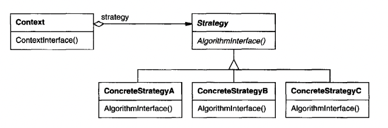

# 1. 스트래티지 패턴 (Strategy Pattern)

## 1. 스트래티지 패턴이란?
알고리즘군을 정의하고 각각을 캡슐화하여 교환해서 사용할 수 있도록 만든다.
스트래티지를 활용하면 알고리즘을 사용하는 클라이언트와는 독립적으로 알고리즘을 변경할 수 있다.





### 구성요소
**1. Context**
- ConcreteStrategy 참조 -> Setter
- Strategy 객체와 소통 역할


**2. Strategy**
- ConcreteStrategy의 generic 인터페이스 역할
- Context에서 사용할 함수 


**3. ConcreteStrategy**
- 세부 행동 구현

### 기본이 되는 디자인 원칙 
**1. Encapsulation:** 애플리케이션에서 달라지는 부분을 찾아내고, 달라지지 않는 부분으로부터 분리한다.

**2. Interface:** 구현이 아닌 인터페이스에 맞춰서 프로그래밍한다.

**3. Composition:** 상속보다는 구성을 활용한다.

## 2. 동기

1. 서로 비슷한 의도가 있지만 behavior에서 차이가 날 때 스트래티지 패턴은 한 클래스에 여러 behavior를 넣어줄 수 있다.

2. 한 클래스가 여러 behavior를 정의하고 있고, 이 behavior들이 복잡한 조건문으로 구현되어 있을 때 사용할 수 있다.

3. 알고리즘을 런타임에서 변경하고 싶을 때 사용할 수 있다.


### 장점
1. 연관된 알고리즘의 그룹화
2. 하위클래스 생성 대안
3. 복잡한 조건문 삭제
4. 구현 선택


### 단점

1. 클라이언트가 모든 스트래티지에 대해 알고 있어야한다.
2. Context 와 Strategy 사이 오버헤드 발생
3. 객체의 수 증가

## 3. 예제
Duck 같은 예제는 많으니 조건문을 스트래티지 패턴으로 리팩토링하는 과정을 써본다.

```
for(Vehicle vehicle : vehicles) {
    switch(vehicle.getType()) {
        case CAR:
            vehicle.lock();
            vehicle.go();
            break;
        case SHIP:
            vehicle.balance();
            vehicle.swim();
            break;
        case AIRPLANE:
            vehicle.go();
            vehicle.fly();
            break;
        case TANK:
            vehicle.move();
            vehicle.stop();
            vehicle.fire();
            break;
    }
    vehicle.stop();    
}
```


move, lock, go, balance, fly, stop, fire 등 여러 behavior에 따라 분기가 필요하니 VehicleAction 이라는 인터페이스를 만든다.


```
interface VehicleAction {
    public void perform();
}

...

class Car extends Vehicle implements VehicleAction {
    ...
    public void perform() {
        lock();
        go();
    }
    
    ...   
}

....

for(Vehicle vehicle : vehicles) {
    if (vehicle instanceof VehicleAction) {
        vehicle.perform();
    }
}
```

복잡한 switch 문은 사라지고 훨씬 깔끔한 코드가 만들어진다.

**개인적인 포인트**

1. behavior 와 algorithm을 거의 같은 의미로 쓰인다.

2. 행동의 디테일을 분리하고 싶을 때 사용

3. 어려운 단어를 사용하는데 Context: 쓰는 놈 / Strategy: 행동 이렇게 생각하면 쉽다.


