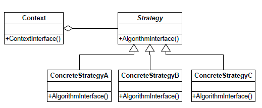

# 1. 전략 패턴
## 책 요약
### 문제상황

- 상속을 사용하여 코드 중복이 최소화 된 상태의 코드가 존재한다.
- 부모 클래스에 새로운 추상 메서드가 추가된다면, 이를 구현하는 자식 클래스에서 모두 해당 메서드를 구현하여야 한다.
- 부모 클래스에 추가된 메서드를 사용하지 않는 하위 클래스도 빈 메서드나 Not Support 관련 에러 등을 구현하여야 한다.
- 하위 클래스 간 동일한 로직이 필요하다면 코드 중복이 발생하게 된다.

### 중간 해결 방안

- 추가될 메서드를 하나의 행동 또는 알고리즘 이라고 할 때, 알고리즘에 대하여 각각 인터페이스로 정의한다.
- 자식 클래스는 사용할 알고리즘에 따라 필요한 인터페이스를 implements 하는 방식으로 처리한다.
- 하지만 인터페이스는 구현이 불가능하기에 구현 클래스에는 로직이 들어가야하며, 동일한 로직이 들어갈 구현 클래스 간에 코드 중복이 존재할 수 있다.
- Java 8 부터 인터페이스에 default method가 추가되어 어느정도 해소될 수 있지만, default method와 다른 알고리즘이 필요하며, 이 구현이 여러 클래스에서 사용되어야 한다면 여전히 중복 문제는 존재한다.

### 최종 해결 방안 (전략 패턴 적용)

- 바뀌는 부분과 그렇지 않은 부분을 분리한다.
- 바뀌지 않는 부분은 부모 클래스에 구현한다.
- 바뀌는 알고리즘들은 적당한 인터페이스로 정의하고, 알고리즘별로 구현 클래스를 생성한다.
- 각 알고리즘은 각자의 구현 클래스 단위로 캡슐화 하였기에 알고리즘의 변화에도
- 런타임에 다른 알고리즘으로 교체가능하다.

---
# 전략 패턴(Strategy Pattern)

전략 패턴은 알고리즘군을 정의하고 캡슐화해서 각각의 알고리즘군을 수정해서 쓸 수 있게 합니다.
전략 패턴을 사용하면 클라이언트로부터 알고리즘을 분리해서 독립적으로 변경할 수 있습니다.

구성은 Context, Strategy 그리고 Strategy 구현체로 이루어져 있습니다.

Context는 사용할 Strategy의 인터페이스 타입을 필드로 갖고있으며, 실제로 사용할 Strategy 구현체를 세팅하여 사용할 전략(알고리즘)을 유연하게 적용 또는 수정할 수 있습니다.

## 적용 방법
1. Context와 Strategy를 식별합니다. 바뀌지 않는 부분을 Context, 바뀌는 부분을 Strategy로 세팅합니다. 
2. Strategy(알고리즘)에 따라 필요한 인터페이스를 정의합니다. 
3. 전략에 대한 알고리즘들을 구현합니다.
4. Context에서 변수로 Strategy를 갖도록 하며, 자유롭게 다른 Strategy 구현체를 바꾸어 적용할 수 있도록 합니다.

### 정리
* 전략패턴의 핵심은 클래스의 알고리즘(행동)은 상속 대신 인터페이스로 캡슐화하여야 한다는 것입니다(composition and interfaces over inheritance).
* 구분이 되었다면 바뀌지 않는 부분은 부모 클래스에 구현하고, 바뀌는 부분에 대하여 공통된 행동에 대하여 인터페이스로 정의하고, 알고리즘을 채워 구현 클래스를 생성합니다.
* 이렇게 적용할 시 각 알고리즘은 각자의 구현 클래스 단위로 캡슐화 되며(Encapsulation), 런타임에 다른 알고리즘으로 쉽게 교체가능합니다.
* 전략패턴은 OCP(open/closed principle)를 잘 따는 패턴입니다. 새로운 알고리즘을 추가하는거나, 알고리즘에 대해 수정할때도 Context 코드에 대한 수정이 필요하지 않습니다.
