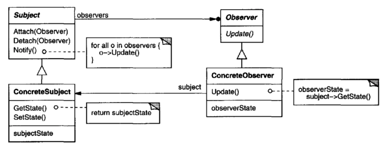
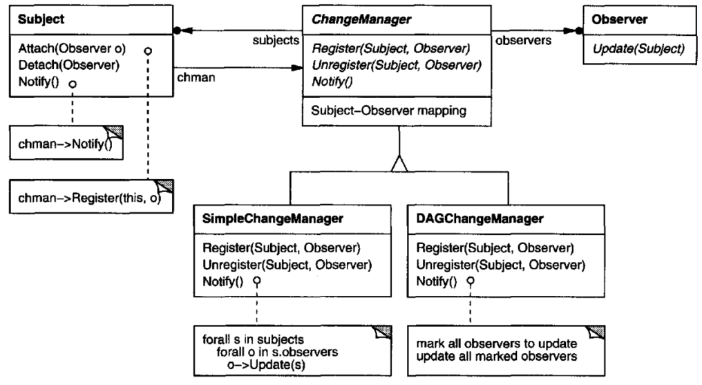

# 2. 옵저버 패턴

# 옵저버 패턴(Observer Pattern)

한 객체의 상태가 바뀌면 그 객체에 의존하는 다른 객체에게 연락이 가고 자동으로 내용이 갱신되는 방식으로 일대다(one-to-many) 의존성을 정의합니다.

## 구성 요소

### Subject

- 주제를 나타내는 인터페이스입니다.
- Observer가 자신을 옵저버 목록으로 등록하거나, 옵저버 목록에서 탈퇴하고 싶을 때에는 Subject 인터페이스의 메서드를 사용합니다.

### Observer

- 옵저버로 쓰일 객체가 구현할 인터페이스입니다.
- Update 메서드를 통해 주제의 상태가 변경됨을 전달받습니다.

### ConcreteSubject

- 주제 역할을 하는 구상 클래스입니다.
- Subject 인터페이스를 구현하며 옵저버 목록을 관리하는 메서드를 지원해야합니다.
- 주제(및 상태)가 변할때 모든 옵저버에게 연락하는 `notifyObserver()` 메서드를 가집니다.

### ConcreteObserver

- 옵저버 구상 클래스입니다.
- Update 메서드를 통해 주제의 상태가 변함을 전달받을 때의 동작을 구현해야합니다.
- ConcreteSubject의 참조도 갖고있습니다. 이는 옵저버 목록에서 탈퇴를 위해 사용합니다.
- subject의 상태를 파악하여 Update 되도록 구현합니다.

## 적용 방법

1. Subject와 Observer 인터페이스를 생성합니다. 주제가 될 데이터에 따라 Observer의 update 메서드의 파라미터는 달라질 수 있지만, Subject 인터페이스의 형태는 일반적으로 고정됩니다.
2. 주제에 따라 ConcreteSubject 클래스를 생성합니다. 이 클래스는 옵저버 목록을 Observer 인터페이스 타입의 리스트로 갖고있습니다. 또한 Update 시 옵저버에게 전달한 주제에 대한 데이터도 필드로 갖도록 합니다.
3. ConcreteObserver 클래스를 생성합니다. 생성자로 ConcreteSubject를 받아 옵저버 목록에 자신을 등록합니다. 이때 ConcreteSubject에 대한 참조는 필드로 저장해두고 추후 옵저버 목록에서 탈퇴하고 싶을때 이 참조를 사용합니다. Update에 따라 처리할 로직을 구현합니다.

## 적용 시기

다음과 같은 상황에서 옵저버 패턴 적용을 고려할 수 있습니다.

- 하나의 컴포넌트에서 두 가지 관심사에 대하여 다루며, 그중 한가지가 다른 하나에 의존관계가 있을 때, 두 관심사를 분리하여 캡슐화하고, 각각을 재사용할 수 있도록 합니다.
- 하나의 객체의 변화가 다른 객체의 변화를 발생시키는데, 변화되는 객체가 여러개일 때, 또는 더 많은 객체들이 변화될 수 있을때 (변화를 야기하는 객체 : Subject, 변화되는 객체 : Observer)

## 정리

- 옵저버 패턴은 Subject 대해 의존성을 갖는 Observer들에 대하여 느슨한 결합(**Loose Coupling**)을 갖도록 합니다.
	- Subject는 몇 개의 Observer가 구독중인지 알 필요가 없으며, 실제 어떤 옵저버 구현이 구독중인지도 모릅니다. 그저 옵저버 인터페이스를 구현한다는 사실만 알고 있습니다.
	- 옵저버는 쉽게 추가될 수 있으며 다른 Subject나 Observer에게 영향을 끼치지 않습니다.
	- 느슨하게 결합되어 있기 때문에 인터페이스만 만족하는 Subject와 Observer라면 어떻게 고쳐져도 문제가 생기지 않습니다.
	- 인터페이스에 맞춰서 프로그래밍하고 있습니다.
- 옵저버 패턴도 달라지는 부분과 달라지지 않는 부분을 분리하는 방식으로 디자인되는 패턴입니다. 달라지지 않는 부분은 옵저버 목록을 등록, 삭제하고 데이터를 발행하는 부분이라면, 달라지는 부분은 Subject에 대해서 이를 구독하는 Observer 의 구현아니 추가되는 Observer 입니다.
	- Subject는 데이터를 발행하고, 옵저버 목록을 추가, 삭제하는 작업만 수행하는 달라지지 않는 지점입니다.
	- 옵저버는 내부 로직이 바뀌거나 언제든지 다른 방식으로 옵저버 목록에 추가될 수 있습니다. 그러므로 Observer 인터페이스와 구현 클래스를 추가로 두어 분리하였습니다.

# 옵저버 패턴에 대한 심층 탐구

옵저버 패턴을 구현 시 겪게되는 이슈들과 이를 해결하는 메커니즘에 대한 정리입니다.

## 1. Subject-to-Observer Mapping

Subject는 Observer 리스트를 참조로 관리하는데 Subject가 많고 Observer가 적은 경우에 차지하는 메모리가 매우 비효율적입니다. 이런 경우 subject와 observer에 대한 매핑 정보를 별도로 관리하는 hash table을 두면 이슈를 해결할 수 있습니다.

저는 이 부분에 대해서 잘 이해가 되지 않아 [구글링](https://stackoverflow.com/questions/52212766/mapping-subjects-to-their-observers-observer-pattern-gof-book)을 조금 해보았는데요, Subject가 많다는 것을 극단적으로 해석할 필요가 있었습니다. Subject는 `List<Observer>`로 옵저버 리스트를 관리할 텐데요, 100만개의 Subject가 있고 Observer가 하나도 없다면 100만개의 빈 리스트가 생성된 상태로 유지가 됩니다.

중앙에서 subject-to-observer 매핑정보를 갖는 HashTable을 둔다면, 옵저버를 가진 `Subject`만 키로 등록하고 값으로 `List<Observer>`를 갖겠죠. 그렇다면 빈 리스트에 대한 참조가 생기지 않을 것이기에 더 메모리 비용 효율적인 옵저버 패턴을 구현할 수 있습니다.

## 2. 하나 이상의 Subject를 구독할 때

하나 이상의 Subject를 구독하고 있는 Observer에서 update 메서드가 호출 된다면, 어떤 Subject로 부터 전파되었는지 모를 수 있습니다. 이런 경우엔 update에서 Subject가 자기 자신에 대한 참조를 함께 전달하여 해결할 수 있습니다.

## 3. Push 방식과 Pull 방식

실제로 update 를 호출하는 방식은 Push 방식과 Pull 방식이 존재합니다.

- Push 방식 : Subject가 책임을 가집니다. 이 방식의 장점은 Client(Observer)는 관리 포인트가 줄어들 며 단지 Subject가 노티할 때 값을 업데이트 하면 되는 구조입니다. 단점으로는 Subject의 연속적인 노티가 발생하는 경우엔 Observer도 속절없이 연속적인 Update의 호출이 발생하게 됩니다. 일정 주기에 따라 Update가 호출되기 바란다면 Push 방식으로는 적합하지 않을 수 있습니다.
- Pull 방식 : Observer가 책임을 가집니다. Subject의 상태 변화로 노티가 발생하여도 Observer는 자신이 필요할 때 Update를 호출합니다. 이 방식은 노티가 들어올 때 즉각적으로 업데이트 시키지 않아야하는 경우에 사용할 수 있습니다. 예를 들어 수치상 아주 작은 값의 변화에도 노티가 계속 발생한다면 Observer는 변화 정도에 대한 임계치를 두고 이 임계치를 넘어설 때만 Update를 수행하도록 할 수 있습니다. 단점으로는 클라이언트가 직접 Update를 수행하지 않을 때 문제가 된다는 점입니다.

## 4. Subject 삭제 시 Dangling ref

Observer는 구독한 Subject의 참조를 갖고 있는데요, 만약 Subject가 삭제되었다면 해당 참조는 Dangling Reference가 되어버립니다. Observer 입장에서는 이를 고려하여 적절한 fallback 처리를 구현할 필요가 있습니다.

권장되는 방법은 대체가능한 Subject를 두어 이를 구독하도록 하는 방법이며, Subject가 삭제되었다고 Observer를 같이 삭제하는것은 피해야할 방법입니다.

## 5. Notify는 마지막에 호출하여야 한다

옵저버 목록에 대한 관리를 제외하고 Subject는 상태 변화와 옵저버들에게 변화에 대한 노티를 수행합니다. 이때 노티를 보내는 행위는 모든 상태 변화가 일어난 후 가장 마지막에 호출되어야 합니다.

Observer의 구현마다 이슈가 없을수도 있지만 일반적으로 노티를 보낸 후 State를 수정하는 행위는 Observer에서도 Update 과정에서 Subject의 State를 통해 작업을 처리하는 경우가 있기에 일괄적으로 Notify 행위는 모든 상태 변화가 끝나고 가장 마지막에 호출하도록 해야 합니다.

## 6. Observer에 한정된 update 프로토콜을 피해라

Push 방식이라면 Subject가 `Observer.update()` 메서드의 파라미터를 통해 모든 데이터를 전달할 것입니다. 아무래도 이런 파라미터는 인터페이스에 고정되어 있을 것이며, Observer는 다른 Subject에서 재사용하기는 어려울 것입니다.

Pull 방식의 경우 `update()` 메서드에 아무런 파라미터를 전달하지 않아도 됩니다. Subject는 상태 변화에 대한 노티만 보낼 뿐 데이터를 받아오는 주체는 Observer이기 때문입니다(Pull 방식을 사용하라라는 뜻으로 보였습니다).

## 7.  관심있는 변화에 대하여 명시하라

Subject가 전달하는 데이터 중 Observer가 실제 필요로 하는 데이터는 일부일 수 있습니다. 이는 Observer를 등록하는 과정에서 관심있는 값(Aspect)에 대해 명시할 수 있다면 큰 비용의 향상을 기대할 수 있습니다. 이 방법을 사용하면 Subject는 노티가 필요한 상황에서 변경된 값에 대해 관심이 있다고 등록한 옵저버에게만 노티를 발송할 수 있습니다.

## 8. 관계가 복잡할 시 ChangeManager를 두어라

Subject-Observer 관계가 너무 복잡하다면 해당 관계만을 관리하는 ChangeManager를 둘 수 있습니다.

위의 다이어그램으로 Subject는 상태 변화에만 집중하고 옵저버 목록에 대한 관리 및 노티는 모두 ChangeManager를 통해 진행하도록 하여 복잡도를 줄였습니다.

참고로 ChangeManager는 중재자 패턴의 인스턴스이며, 하나의 관리자로 두어 사용하기에 싱글턴 패턴을 적용할 수 있습니다.

## 9. Subject와 Observer 를 통합하라

몇몇 언어에서는 Subject와 Observer를 통합해서 사용하는 경우가 있습니다(Smalltalk가 그렇다고 하네요). 이는 Observer가 다른 이의 Subject가 될 수 있는 경우에 상속을 줄이기 위한 방법으로 제시됩니다.
